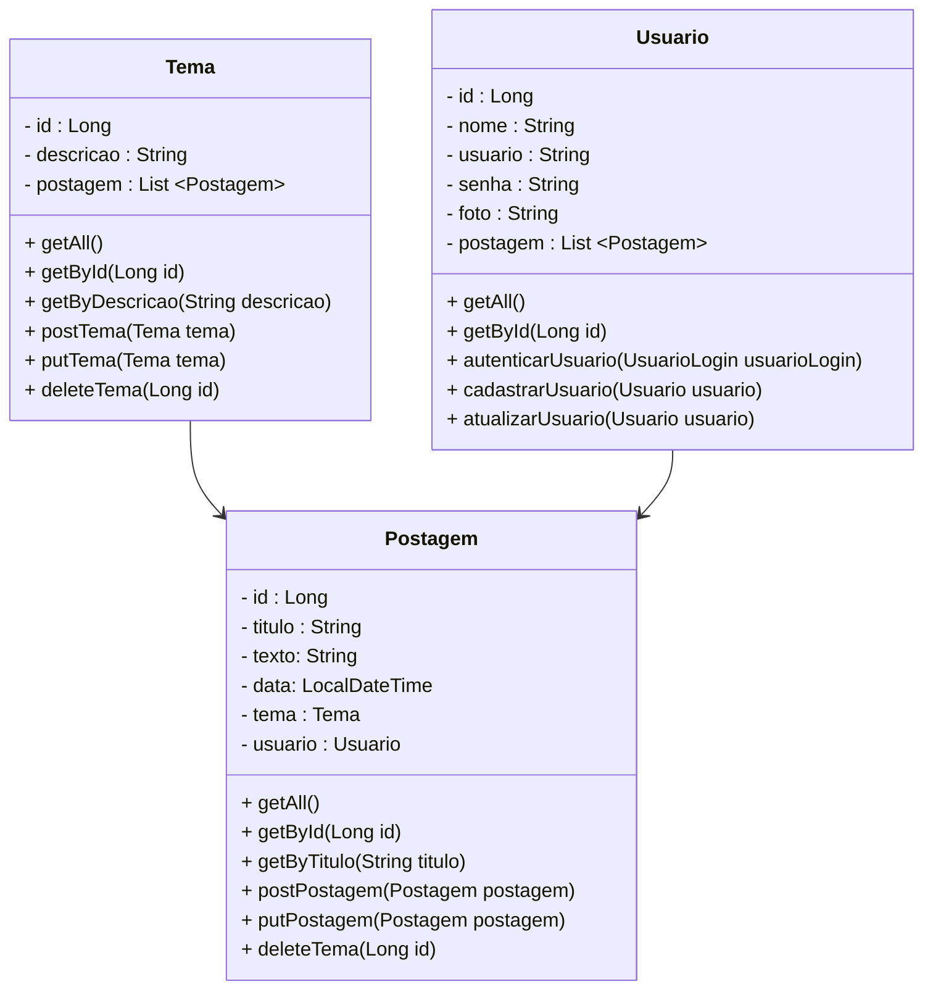

# Projeto Blog Pessoal

 

   

  

## Diagrama de Classes

  

# Referências sobre NestJS

 

<a href="https://docs.nestjs.com/" target="_blank">Documentação Oficial do NestJS</a>

<a href="https://typeorm.io/" target="_blank">Documentação Oficial do TypeORM</a>

<a href="https://www.typescriptlang.org/pt/docs/" target="_blank">Documentação Oficial TypeScript</a>

<a href="https://docs.npmjs.com/" target="_blank">Documentação do NPM</a>

<a href="https://www.tutorialspoint.com/typeorm/typeorm_quick_guide.htm" target="_blank">Guia do TypeORM</a>
